<h1 align="center"> Sistema de Agendamento da Clínica de Estética </h1>

O Sistema é um agendamento de consulta para uma Clínica de Estética. O seu principal objetivo é cadastrar e gerenciar as consultas realizadas pelo usuário. As tecnologias utilizadas foram a linguagem C# e manipulação de dados através do SQL. As plataformas foram Visual Studio 2022 e MYSQL WorkBench. 

<h5 align="center">Tela de Login:</h5>
  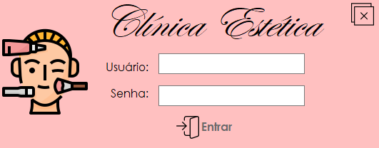 
 
<h5 align="center">Tela Login com Dados do Usuário:</h5>
  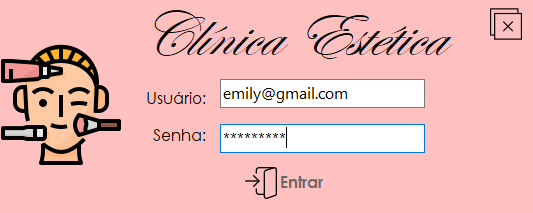 

 
<h5 align="center">Tela Principal: (É possível cadastrar, buscar clientes, fazer alterações e deletar)</h5>
  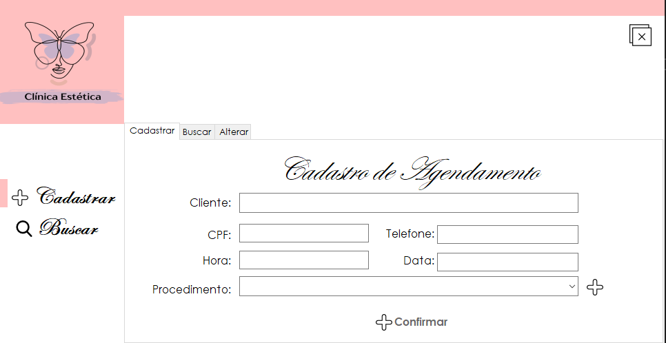 
 
<h5 align="center">Tela Cadastro:</h5>
  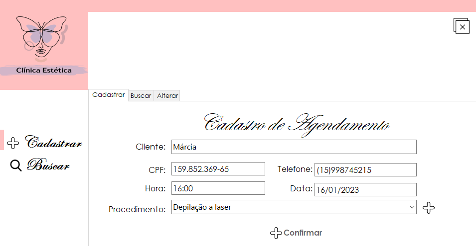 

<h5 align="center">Resultado do Cadastro:</h5>
  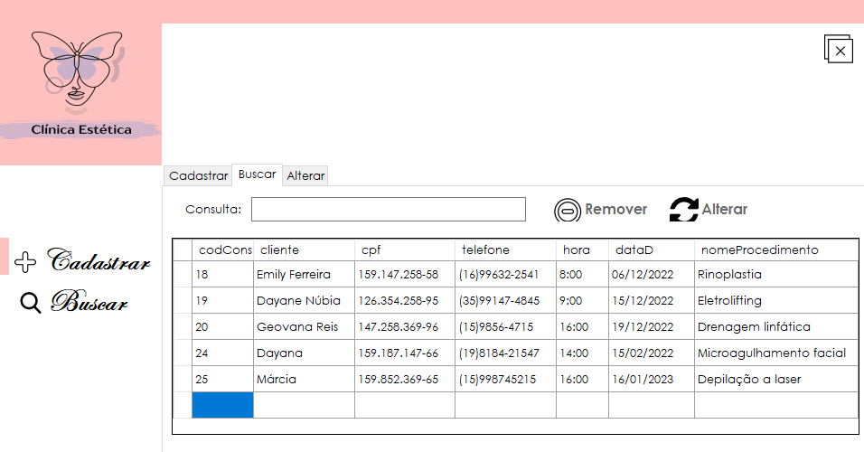 
<h5 align="center">Busca por nome de Cliente:</h5>
  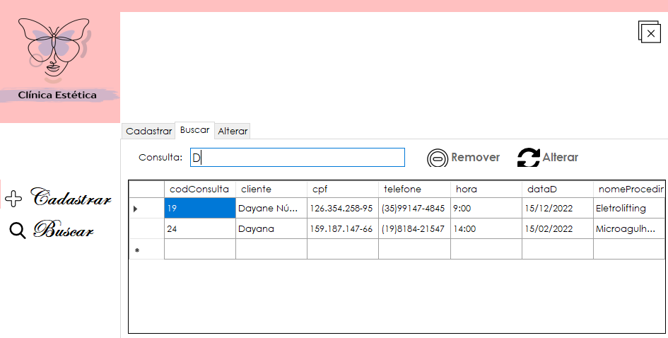   
<h5 align="center">Tela de Alteração (traz as informações do cliente selecionado):</h5>
  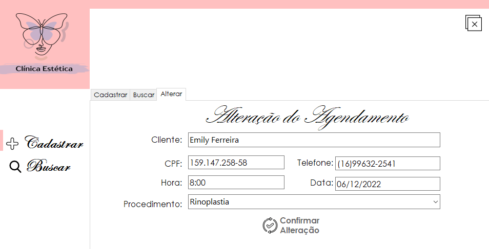   
<h5 align="center">Resultado da Alteração:</h5>
  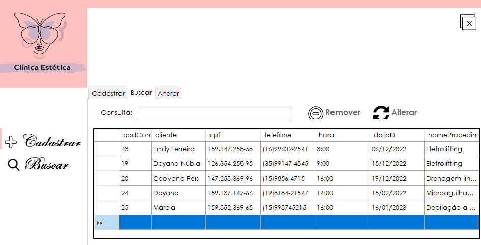   
<h5 align="center">Exclusão (seleciona a linha do cliente, e clica no botão remover):</h5>
  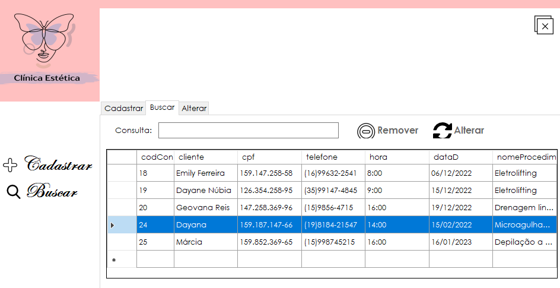   
<h5 align="center">Resultado da Exclusão:</h5>
  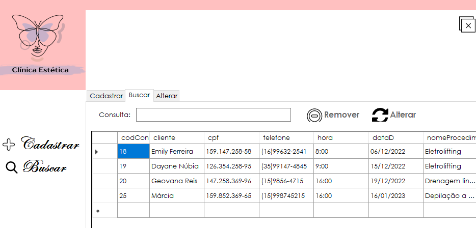   
<h5 align="center">Listar Procedimento (Clicando no botão mais, é possível adicionar procedimentos):</h5>
  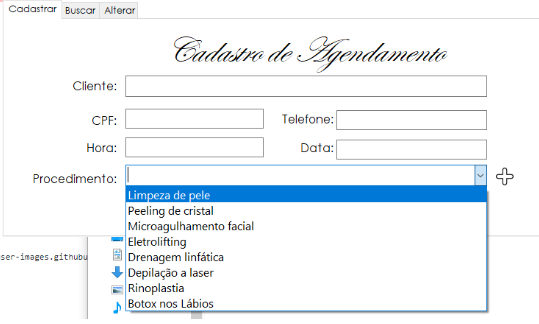   
 <h5 align="center">Adicionar Procedimento (Clicando no botão confirmar):</h5>
  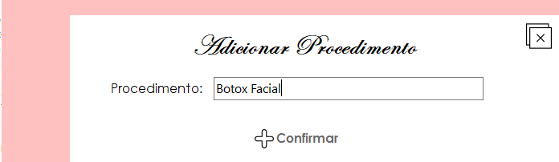   
<h5 align="center">Resultado do Adicionando:</h5>
  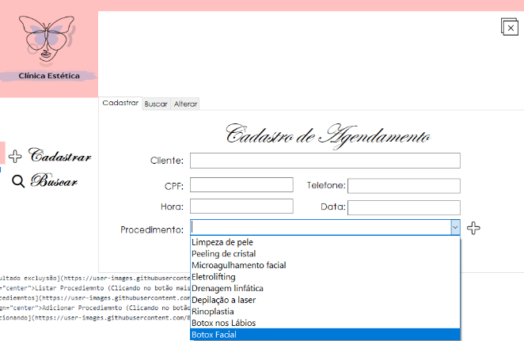 
